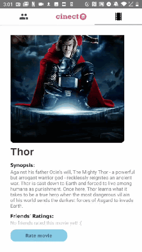
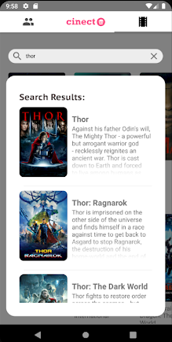

## What is it?
Cinect aims to help groups of friends decide on a movie to watch together.

## How?
### Swipes
In the homepage, Cinect presents a stack of the latest movies available to watch in the cinema or at home, filtered by your genre preferences. You can swipe right to put it in your watch list, or swipe left to indicate no interest.

### Preferences
You can specify your genre preferences in settings to allow the app to tailor suggestions to your taste.

### Groups
You can create groups with your Facebook friends. Each group profile will have a list of recommended movies to watch.

## Other cool features
### Ratings and reviews
Leave ratings and reviews to express your opinions to your friends! Ratings and reviews will appear on each movie information card.

### Where to watch?
Each movie information card will tell you whether the movie is available on streaming service such as Netflix, etc.

### Search for specific movies
You are not limited to what the app suggests for you, you can find any movie that you want to watch!

### User profiles
You can also view your friend's user profiles to get movie inspirations.

------------
###### Authors: Ashly Lau, Christopher Gunadi, Esther Wong, Jasmine Quah
